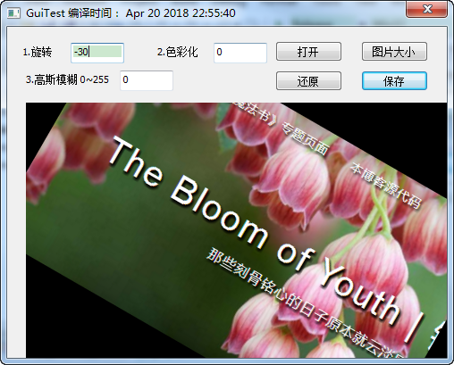
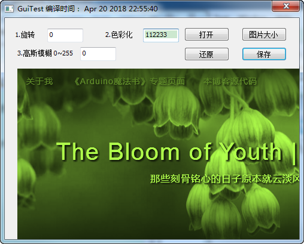
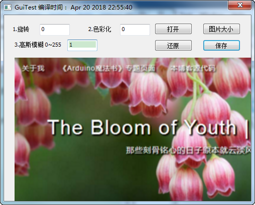

偶然间看到Yahoo的一份代码中有图形算法。

想去当初做图形项目时最大的瓶颈就是算法，忍不住又撸了下代码。

项目地址：[ygloo-ymagine](https://github.com/YahooArchive/ygloo-ymagine),是安卓的作品，使用jni调用的底层C代码。

扫了下代码，提取了部分C代码，大部分代码没有，还有些功能没有实现。

移植为lib，做了个Win32的Demo，实现任意角度旋转，高斯模仿和图片色彩化。

任意角度旋转

色彩画

高斯模糊

